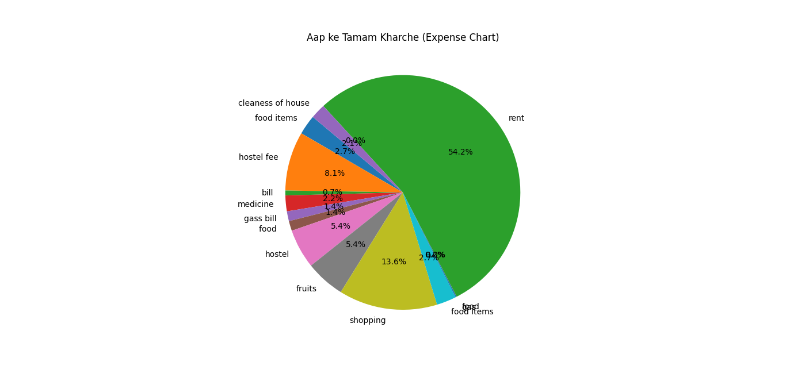

A professional desktop application built using Python to help users monitor and manage their daily expenses. It integrates a relational database for secure storage and provides data analytics through visual graphs.

## 🚀 Features
* *Expense Logging:* Add, view, and organize daily expenses.
* *Database Integration:* Secure and structured data storage.
* *Data Visualization:* Generates dynamic charts to analyze spending habits.

## 🛠️ Technologies Used
* *Language:* Python
* *Database:* MySQL
* *Libraries:* Matplotlib, MySQL Connector

## 📊 Project Output
Here is the visual chart generated by the application:


## 💻 How to Run
1. Clone the repository or download test.py.
2. Install required packages:
```bash
   pip install matplotlib mysql-connector-python
